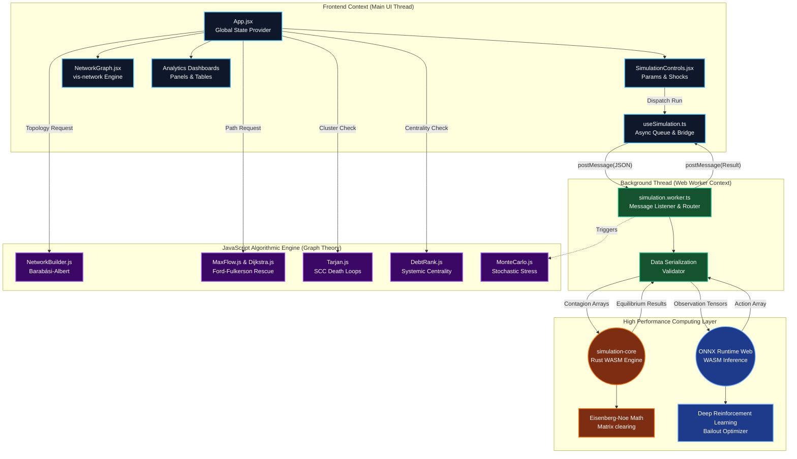
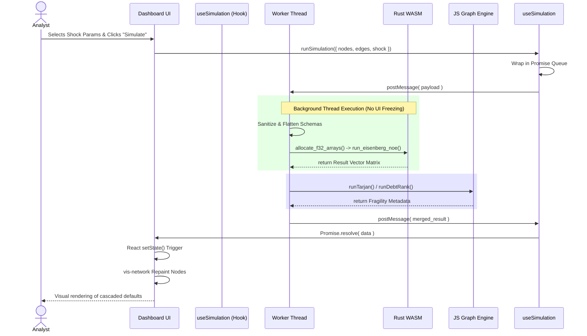

# 🏛️ System Architecture: Cascading Liquidity Contagion Simulator

## Executive Summary
This document provides an exhaustive architectural, technical, and algorithmic breakdown of the **Cascading Liquidity Contagion Simulator**. 

Built as a high-performance financial systemic risk analysis platform, this application models interbank lending networks, default contagion (via the Eisenberg-Noe framework), and optimal central bank interventions (via Deep Reinforcement Learning and Network Flow theory). 

The platform utilizes a sophisticated **Hybrid Web Architecture**:
- **Frontend Layer**: A highly responsive React/Vite UI for global state management and high-fidelity graph rendering using `vis-network` and responsive CSS grid dashboards.
- **Middleware Layer**: Asynchronous React Hooks acting as a promise-based API bridge.
- **Concurrency Layer**: A Web Worker thread (`simulation.worker.ts`) dedicated exclusively to heavy data serialization, deserialization, and task routing.
- **Compute Layer**: A high-performance **Rust-based WebAssembly (WASM)** core that parallelizes intense graph permutations, matrix math, and Deep Reinforcement Learning (DRL) operations.

This separation of concerns ensures that the application can model millions of Monte Carlo permutations simultaneously without ever causing frame drops or locking the main browser UI thread, providing an enterprise-grade experience for risk analysts.

---

## 🗺️ Comprehensive Architecture Diagram

The system is segregated into distinct execution contexts: UI Thread, Worker Thread, and WASM Runtime.

---

## ⚙️ Execution Layers & Data Flow Sequence

To fully grasp the architecture, it is essential to understand the lifecycle of a simulation event.

### 1. The Interaction & Presentation Layer (UI Thread)

The UI is built with React and heavily layered into isolated components to prevent cascading re-renders.
* **`App.jsx`**: Acts as the God-Component orchestrating global application state. It manages the fundamental `cascadeState` (health of institutions), `selectedNodeId`, and global `simulationData`.
* **`NetworkGraph.jsx`**: The core interactive visualizer. It wraps the `vis-network` canvas library, applying a specialized `forceAtlas2Based` physics simulation. This visually represents the gravity of debts—institutions with massive interconnections are pulled closer, while defaulting banks are repainted synchronously based on state transitions.
* **Analytical Dashboards**: Segmented data viewers updated purely by state props:
  * **`RescuePanel.jsx`**: Highlights network flow bottlenecks.
  * **`MonteCarloPanel.jsx`**: Renders Gaussian distribution curves for probable bank collapse occurrences.
  * **`ExplanationLog.jsx`**: A deterministic narrative engine that parses mathematical deltas into plain English (e.g., "Bank A defaulted due to 30% asset evaporation").

### 2. The Bridge: API Abstraction (`useSimulation.ts`)

* **Role**: Promise-based Message Queue.
* **Mechanism**: React components do not directly interface with Web Workers. Instead they call functions on the `useSimulation` hook (`runSimulation`, `getBailoutRecommendation`). 
* **Process**: This hook packages the complex network topologies and shock parameters into a JSON object, attaches a unique transaction ID, fires `worker.postMessage()`, and returns a Promise to the UI. When the worker replies with the matching transaction ID, the Promise resolves, gracefully triggering a React state update.

### 3. Concurrency Layer (`simulation.worker.ts`)

* **Role**: Background Router and Sanitizer.
* **Mechanism**: Runs purely in the background. It intercepts incoming JSON graphs and strictly validates schema formatting. Passing incorrectly formatted objects into WASM causes fatal memory panics, so this worker acts as the type-safety guard.
* It routes the mathematical request to either the Rust WASM core or pure JS fallbacks depending on computational weight.

### 4. The Physics & Compute Engine (`simulation-core` in Rust/WASM)

* **Role**: Hyper-optimized calculation execution.
* **Mechanism**: Implementing the Eisenberg-Noe clearing vectors requires massive matrix iterations. JavaScript is extremely slow at large multi-dimensional array operations. 
* By compiling Rust to WebAssembly, the application uses linear shared memory and zero-cost abstractions to calculate node default thresholds recursively at near-native speeds. It accepts flattened typed arrays (`Float32Array`) from the JS Worker, computes the clearing vector, and returns the result.

### 5. DRL AI Layer (`ort-wasm`)

* **Role**: Intelligent Bailout Strategy Optimizer.
* **Mechanism**: To determine exactly which failing banks should receive Federal bailout funds, we utilize an ONNX-exported Deep Reinforcement Learning (DRL) network. `simulation.worker.ts` feeds tensor observations (bank health matrices) directly into the `ort-wasm` (ONNX Runtime Web) engine operating entirely in the browser. 

---

## 🧠 Algorithmic Modules (`src/engine/`)

The core of the application's financial intelligence is spread across specific algorithmic models rooted in graph theory and financial economics.

### Default Mechanics (`EisenbergNoe.js` / Rust Core)
* **Mathematical Basis**: If Bank A collapses, it only repays a fraction of its debts to Bank B. Bank B must mark-to-market its assets. If Bank B's capital ratio drops below regulatory minimums, it also defaults. The algorithm iteratively cascades these fractional payments until the entire network reaches a fixed point (equilibrium).

### Stress Testing (`MonteCarlo.js`)
* **Mechanism**: Instead of a single shock, this engine generates stochastic (random) "noise" variables drawn from a Box-Muller normal distribution. It repeats the simulation 10,000+ times per second in the background, outputting the *statistical probability* of any given node entering default.

### Pathfinding & Network Rescue Pipelines
* **`MaxFlow.js` (Ford-Fulkerson Algorithm / Edmonds-Karp)**: Treats the interbank lending network like a set of water pipes. It calculates the maximum theoretical liquidity a central bank could pump into a distressed node without exceeding the "capacity" (trust limits) of intermediary lending nodes.
* **`Dijkstra.js`**: Re-weighted shortest path algorithm. Weighs edges inversely proportional to capitalization, defining the lowest-resistance path a contagion wave will follow.

### Fragility & Death Loop Detection
* **`Tarjan.js` (Strongly Connected Components)**: A crisis entering an SCC (Node A owes B, B owes C, C owes A) creates an infinite destructive feedback loop. Tarjan's algorithm isolates these cyclical clusters in $O(V+E)$ time, highlighting systemic sinkholes.
* **`DebtRank.js`**: Iterative eigenvalue centrality. Calculates impact not by raw size, but by position in the network topology, successfully identifying highly leveraged but relatively small mid-tier brokers (e.g., Lehman Brothers equivalent nodes).

### Data Topologies
* **`NetworkBuilder.js`**: Generates synthetic banking networks using the Barabási-Albert model (Preferential Attachment). Ensures realistic "hub-and-spoke" network topologies rather than uniform distributions.
* **`Scenarios.js`**: Hardcoded legacy network graph states (e.g., historical reconstructions of 2008).

---

## 🛠 Flow Diagram: The User Journey

## 🔒 Security & Data Considerations
All network structures, bailout algorithms, and calculations happen purely locally on the client's architecture. Because the intelligence (Rust/WASM and ONNX Models) executes instantly within the browser's sandbox without round-trip times to an external API, highly sensitive corporate or systemic network topologies are never exposed to external servers. This fulfills strict data security compliance for high-security financial environments.
